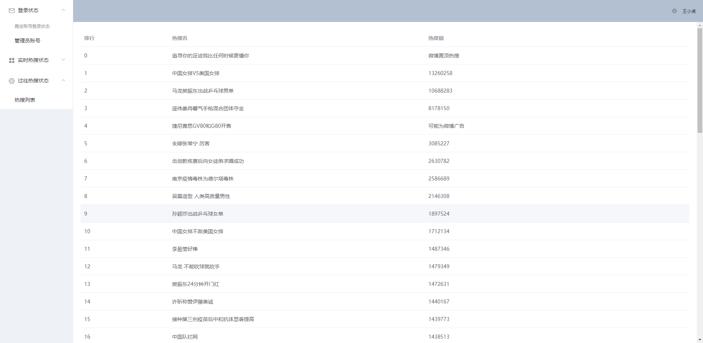
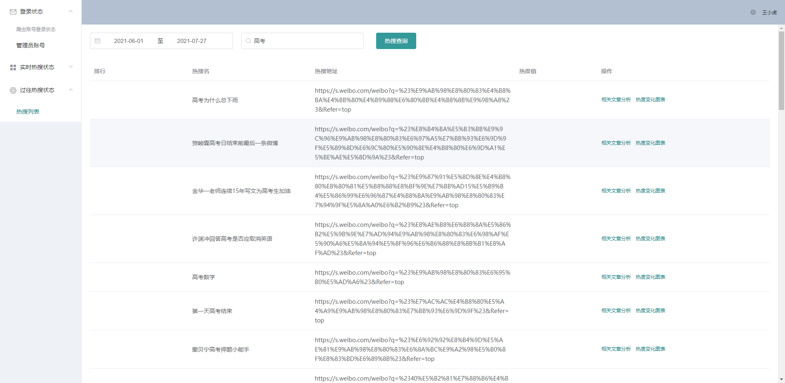
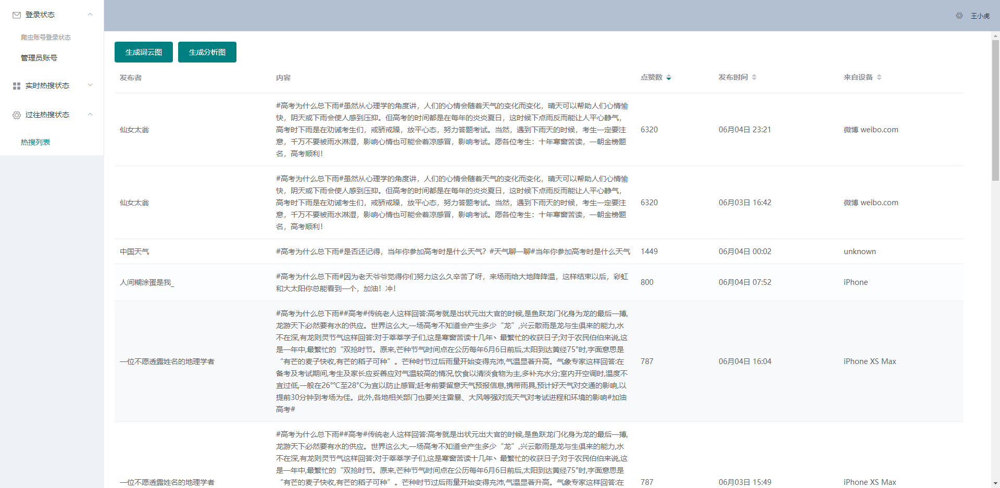
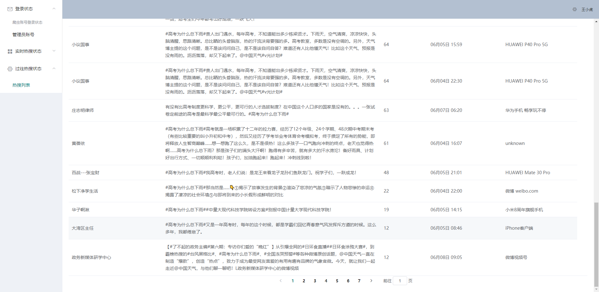
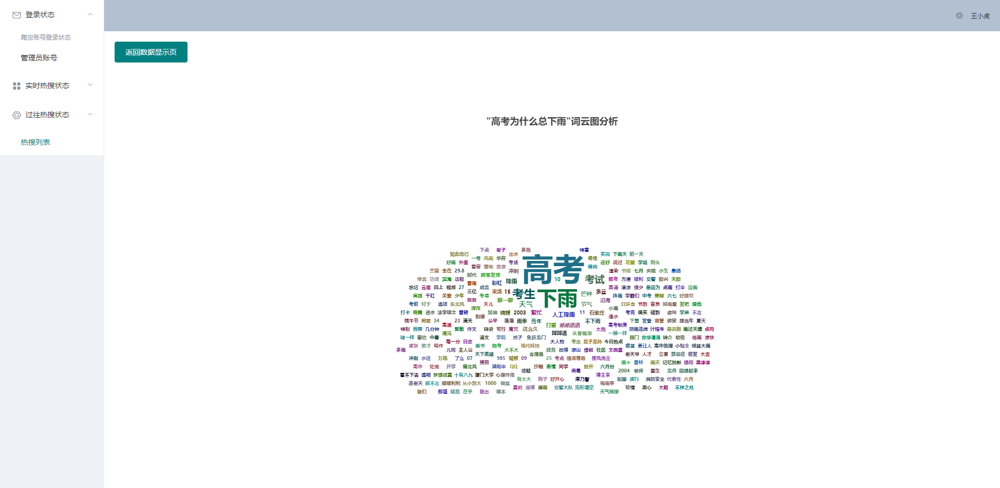

# puppeteer使用之微博爬虫

## 1.使用说明

#### 1.1开发环境 node.js@14  vue@2.6  mongodb

#### 1.2安装说明

admin文件夹下 npm install

server文件夹下 npm install

#### 1.3启动说明

admin文件夹下 npm run serve

server文件夹下 npm run serve

成功后浏览器输入http://localhost:8080/即可

## 2.功能说明

#### 2.1主要功能

1.爬取实时微博排名并存入数据库

2.可开关自动爬取功能

3.统计某一热搜热度变化

4.以往热搜查询功能（需存入数据库）

5.生成词云图

6.未完待续

#### 2.2截图展示

